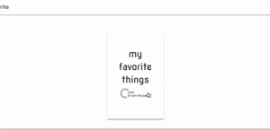
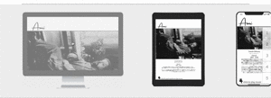

<!-- AUTO-GENERATED-CONTENT:START (STARTER) -->

# 澤井安海のポートフォリオ  
  
使用言語：gatsbyJs  
  
# Topページ  
自己紹介と作成したwebページ紹介するページ  
https://amis-acat.netlify.app/  
  
  
  
  
▼　テキスト（Ami）が動くアニメーション:scssで実装  
　
  
  
  
  
▼　冊子のようなアニメーション：React Hoock、scssで実装  

  
  
  
  
画像が下から出現するアニメーション：React Hoock、scssで実装  
（目がチカチカするのでデモなし）  
  
  
  
  
▼　ディスプレイ内のスクロール：scssで実装  

ディスプレイをクリックすると以下に遷移します  
  
▶︎　https://amis-acat.netlify.app/page1/  
▶︎　https://amis-acat.netlify.app/page2/  

<!-- AUTO-GENERATED-CONTENT:END -->
